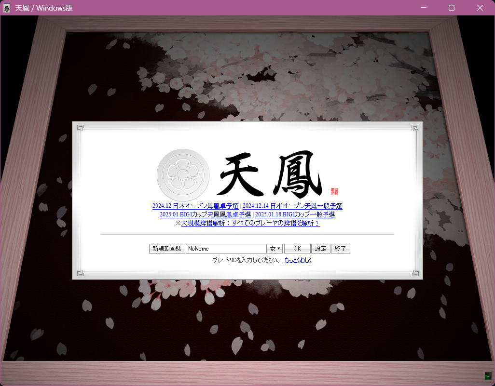
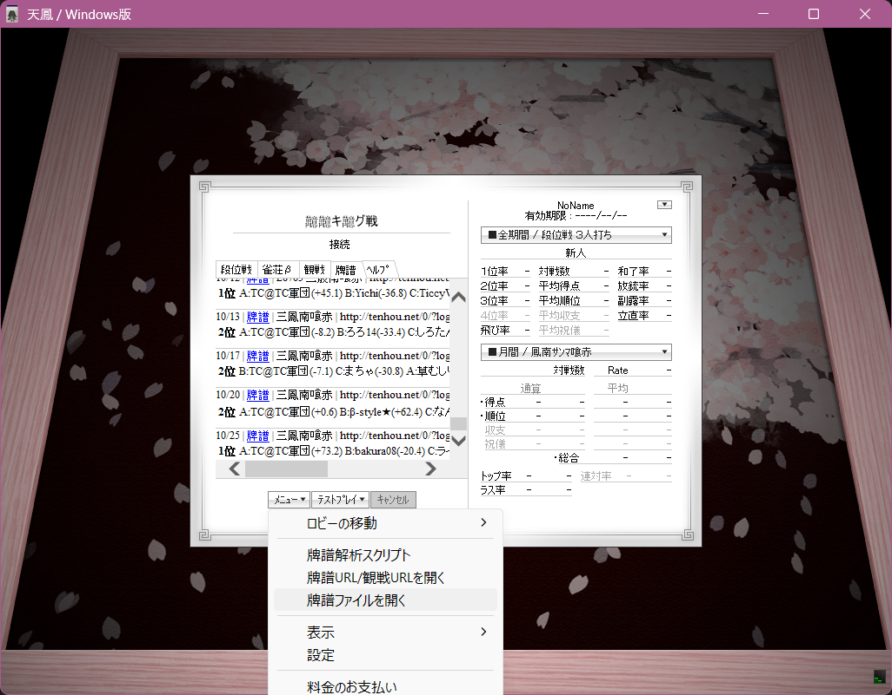
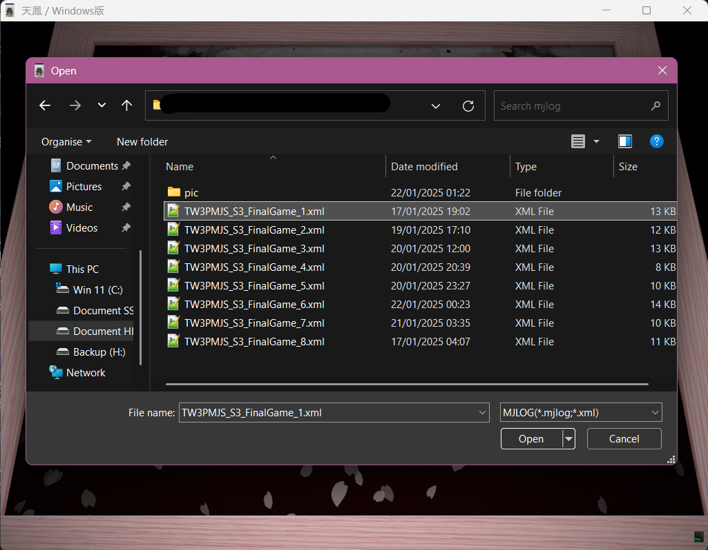

# 第三屆台灣三麻名人戰 頭銜戰對局牌譜

本repo存放經採譜並且轉檔為.mjlog格式的頭銜戰對局牌譜，須使用**天鳳Windows版**進行開啟。若為非Windows使用者，目前.mjlog暫不支援Windows版，請改行閱讀[紙本牌譜](https://cdn.discordapp.com/attachments/1149733468364886136/1331302081159757895/b47221a0c233c4f8.pdf?ex=67911f2e&is=678fcdae&hm=e95409759c25b14971805083a9c41f17486bfe70c2050fbd940c508f3fe7600c&)。

另記分表、簡章及直播紀錄請參見右方連結。[計分表點我](https://docs.google.com/spreadsheets/d/1bFuefzjcWxiZ1rb29PK3fgdZE713nEdgo8pEJ20eYZU)，[簡章點我](https://drive.google.com/file/d/14kP23hqaxPGX0HM86dDshcPOdGDw37c8)，[直播紀錄點我](https://www.youtube.com/live/n_WNkw-Xmwk)。

## 使用說明

### 天鳳Windows版安裝

請點選[下載連結](https://tenhou.net/1/tenhou-win.msi)下載.msi安裝檔案，並且依照指示進行安裝。安裝完成後可於開始選單內開啟天鳳Windows版。

### 安裝轉區軟體(可選)

天鳳Windows版若運行在非日文環境下文字會顯示亂碼，可安裝轉區軟體Locale Emulator修正，安裝教學及連結請參照[官方網址](https://xupefei.github.io/Locale-Emulator/)。

若不安裝轉區軟體仍可正常閱讀，惟顯示文字時為亂碼，但對照選項仍可正常使用

### 牌譜下載

點擊右上方綠色按鈕``Code``，並於選單中選取``Download ZIP``，下載.zip檔後解壓至任意位址，正確下載後資料夾內應有8個.xml檔案，一個檔案對應一個半莊。

### 開啟牌譜

開啟天鳳Windows版，點選``OK``→``メニュー``→``牌譜ファイル開く``→選取想要打開的半莊所對應的.xml檔案→完成！

若未安裝轉區軟體，可於下方螢幕截圖參照對應按鈕位置

### 顯示玩家名稱(可選)

**請注意，此部分須於安裝天鳳Windows版該電腦，在開啟保存對局牌譜功能後，進行至少一場對局後才可使用**

天鳳Windows版預設會對非本機的對局進行匿名處理，參照下列方法可將牌譜中的玩家ID顯示。

* 開啟檔案總管至位址``C:\Users\<你的使用者>\Documents\My Tenhou\log``

* 打開任意一個資料夾

* 複製任一個.mjlog檔案之**檔案名稱**，如``2024102515gm-00b9-0000-1b1bfc0c&tw=0``

* 將下載下來的.xml牌譜名稱，修改為上一步複製之檔名。

* 依照正常步驟開啟牌譜，完成！
